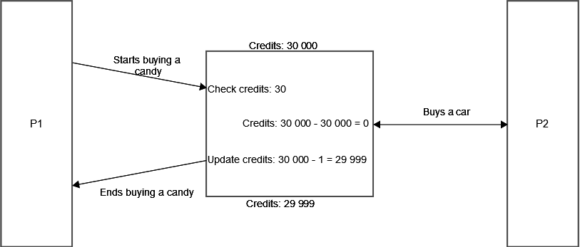
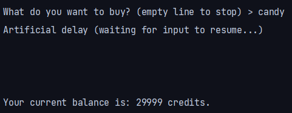
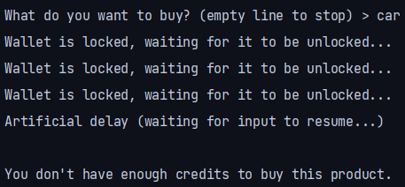

# Part 0

- How to compile

Simply run `make` in the root directory.

If you need to only reset the state, run `make reset`.

- How to run

A utility script called `run.sh` is provided, as well as a `run.bat` for
Windows.

You will get some artificial delay while testing this program, to give you the
time to try everything.

# Part 1

- What is the shared resource? Who is sharing it?

The shared resource are the files `wallet.txt` and `pocket.txt`. All instances
of the program will try to read and / or write these files.

- What is the root of the problem?

Files access are not controlled, so the program is vulnerable to concurrent
access races. If a process `P1` reads the file `wallet.txt` concurrently to a
process `P2`, we can get race side effects.

- Explain in detail how you can attack this system.

    - Step 1: `P1` starts buying a candy, credits = 30000
    - Step 2: `P2` buys the car, credits = 0
    - Step 3: `P1` resumes buying the candy, credits = 29999

- Provide the program output and result, explaining the interleaving to achieve
  them.



# Part 2

- Solution

The code securing this API by locking `wallet.txt` is:

```java
public class Wallet {
    public synchronized boolean safeWithdraw(int valueToWithdraw)
        throws IOException, IllegalArgumentException, InterruptedException {
        FileLock lock;

        while ((lock = _file.getChannel().tryLock()) == null) {
            System.err.println(
                "Wallet is locked, waiting for it to be unlocked..."
            );
            Thread.sleep(1000);
        }

        boolean ok = false;
        try {
            int balance = getBalance();

            delay();

            if (balance >= valueToWithdraw) {
                setBalance(balance - valueToWithdraw);
                ok = true;
            }
        } finally {
            lock.release();
        }

        return ok;
    }
}
```

The function `safeWithdraw` is set as synchronized, so it is guaranteed that in
a concurrent context, only one thread will be able to access it at a time. This
acts as a per-thread locking mechanism.

Note that this code can have different behaviors depending on the platform. On
Windows, the file will be locked at a system level and every application will
see its access denied. On WSL version 1, it will simply not work as the file
will silently not be locked. On WSL version 2 or any regular Unix system, the
file will be locked for two concurrent process running this code but not for any
other arbitrary process, like `rm`. Since there is no system-wide file locking
mechanism, they will still be able to modify the file. This, however, is out of
the scope of this lab.

With this implementation, the scenario above raise the following simplified
output:



*P1 buys a candy and takes some time to process the transaction*



*P2 tries to buy a car while P1 is still processing the candy transaction*

For P2, the transaction is not completed, and the balance is not updated.

In a real-world scenario, one might want to replace this active fetching of the
balance with a passive one, by using `lock()` instead of `tryLock()`. This will
however freeze the program.

One patched, when P1 starts buying a candy, it will lock the wallet file. This
will prevent P2 from buying a car, since the wallet file is locked. P2 will then
wait for P1 to finish the transaction by waiting for the file to be unlocked.
Once unlocked, P2 will then try to buy the car, and this transaction will fail
as it should.

- Other API suffering from the same problem

The same problem happens with `pocket.txt`, which could erase the content of the
file for parallels process.

```java
public class Pocket {
    public void addProduct(String product) throws IOException {
        FileLock lock = this._file.getChannel().lock();
        this._file.seek(this._file.length());
        this._file.writeBytes(product + '\n');
        lock.release();
    }
}
```
