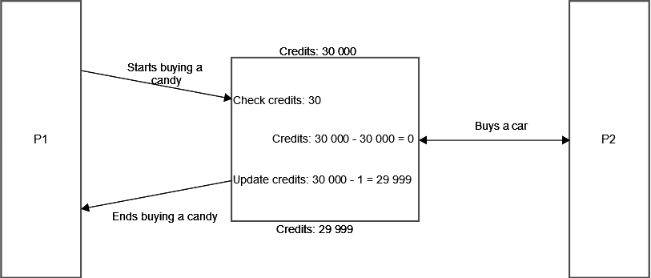

Romain THEODET

# Part 0

- How to compile

Simply run `make` in the root directory.

- How to run

A utility script called `run.sh` is provided, as well as a `run.bat` for
Windows.

# Part 1

- What is the shared resource? Who is sharing it?

The shared resource are the files `wallet.txt` and `pocket.txt`. All instances
of the program will try to read and / or write these files.

- What is the root of the problem?

Files access are not controlled, so the program is vulnerable to concurrent
access races. If a process `P1` reads the file `wallet.txt` concurrently to a
process `P2`, we can get race side effects.

- Explain in detail how you can attack this system.

    - Step 1: `P1` starts buying a candy, credits = 30000
    - Step 2: `P2` buys the car, credits = 0
    - Step 3: `P1` resumes buying the candy, credits = 29999

- Provide the program output and result, explaining the interleaving to achieve
  them.



# Part 2

- Solution

The code securing this API by locking `wallet.txt` is:

```java
public class Wallet {
    public synchronized boolean safeWithdraw(int valueToWithdraw)
        throws IOException, InterruptedException {
        FileLock lock;

        while ((lock = _file.getChannel().tryLock()) == null) {
            // We could use `lock()` instead of `tryLock()`, but it is not
            //  really user-friendly as it will block the program.
            System.err.println(
                "Wallet is locked, waiting for it to be unlocked...");
            Thread.sleep(1000);
        }

        int balance = getBalance();
        if (balance < valueToWithdraw) {
            return false;
        } else {
            setBalance(balance - valueToWithdraw);
        }

        lock.release();
        return true;
    }
}
```

WARNING: Note that this code only works on Windows systems. Unix systems, on the
other hand, don't enforce file locks at the OS level. A solution could be to
create a file lock ourselves containing the PID of the process that is currently
holding the lock. This is however a dangerous solution, as a process crashing
without releasing the lock will definitively prevent other processes from
acquiring it.

- Other API suffering from the same problem

The same problem happens with `pocket.txt`, which could erase the content of the
file for parallels process.

```java
public class Pocket {
    public void addProduct(String product) throws IOException {
        FileLock lock = this._file.getChannel().lock();
        this._file.seek(this._file.length());
        this._file.writeBytes(product + '\n');
        lock.release();
    }
}
```
