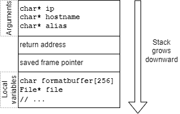

# 1 - Gaining root access

For this first part, we will gain root access through a buffer overflow
vulnerability and a malicious shellcode. With a buffer overflow, a
string can overwrite some memory and become executable. While there
exists countermeasures, they aren't implemented here, hence our attack.

## 1.1 - Memory layout and vulnerability

When we look at the source code of `addhostalias.c`, the vulnerability
opportunity is very clear:

```c
void add_alias(char *ip, char *hostname, char *alias) {
    char formatbuffer[256];
    // ...
    sprintf(formatbuffer, "%s\t%s\t%s\n", ip, hostname, alias);
    // ...
}

int main(int argc, char *argv[]) {
    // ...
    add_alias(argv[IPADDR], argv[HOSTNAME], argv[ALIAS]);
    // ...
}
```

We're trying to insert in `formatbuffer` strings without checking their
length. The main function simply reads its arguments and forwards it to
`add_alias`, which will insert it in its buffer. The thing is, what if
our string become too long? If it hits 256 characters or more, we will
exit our buffer and write our string on top of our memory.



What we want to do is override the return address to jump back in the
buffer and execute the string as if it was some code.

## 1.2 - Create the exploit

## 1.3 - Scripts used

## 1.4 - Permanent root access

# 2 - Discussion and countermeasures
